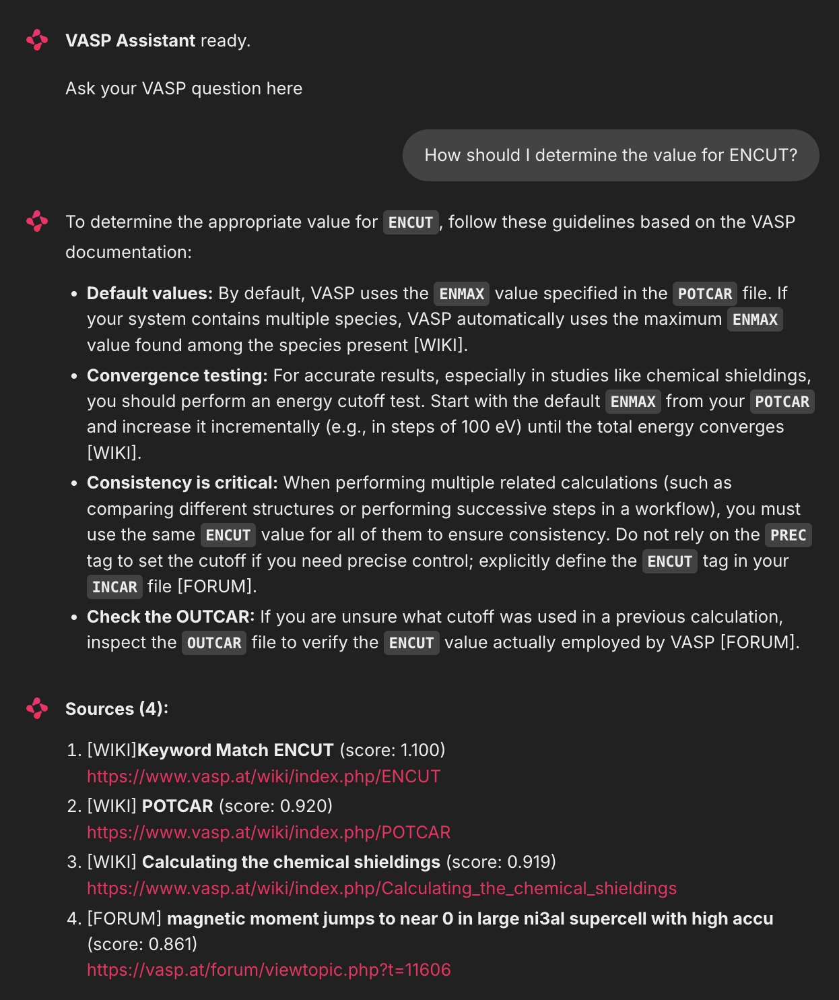

# VASP Retrieval Augmented Generation (RAG) Assistant

A RAG tool for querying VASP (Vienna ab initio Simulation Package) documentation, forum posts, and research papers through a conversational chat interface.

VASP is a state of the art density functional theory (DFT) tool widely used in computational materials science, quantum chemistry, and condensed matter physics. This tool allows researchers to spend more time on research instead of digging through wiki and forum posts.



## Features

- **Hybrid Retrieval** combines keyword search with semantic vector search so specific tag phrases (`ENCUT`, `ISMEAR`, `EDIFF`) are always surfaced.

- **Guaranteed wiki + forum Results** - wiki documentation and forum discussion are queried separately, ensuring both authoritative reference and practical advice appear in every answer.

- **PDF Ingestion** allows users to add additional context to the knowledge base with a single command.

- **Source Citations** - every answer shows the most relevant wiki pages and forum posts.

- **Browser-based UI** — built with Chainlit, accessible at `localhost:8000`

**Data sources:** VASP wiki (~1,000 pages) and VASP forum (~8,600 threads) **included in** `chroma_storage`. Users may add pdfs for additional context. 

---

## Quickstart

**Requirements:** Python 3.11, git lfs, [Gemini API key](https://aistudio.google.com) (free)

```bash
# 1. Clone the repo
git clone https://github.com/yourusername/vasp-rag
cd vasp-rag

# 2. Create environment

# 2a. using conda
conda create -n vasp-rag python=3.11
conda activate vasp-rag
pip install -r requirements.txt

# 2b. or .venv
python3 -m venv .venv
source .venv/bin/activate
pip install -r requirements.txt 

# 3. Configure
cp .env.example .env
# Edit .env — set your API key (see Configuration below)

# 4. Launch
chainlit run app.py
```

Open `http://localhost:8000` in your browser.


## Configuration
 
| Variable | Default | Description |
|---|---|---|
| `GEMINI_API_KEY` | — | Required. Get a free key at [aistudio.google.com](https://aistudio.google.com) |
| `GEMINI_MODEL` | `gemini-3.1-flash-lite` | Gemini model name |
| `WIKI_TOP_K` | `2` | Wiki chunks retrieved per query |
| `FORUM_TOP_K` | `3` | Forum chunks retrieved per query |


## Project Structure

```
vasp-rag/
├── app.py              # Chainlit chat interface
├── retriever.py        # Hybrid keyword + vector retrieval
├── llm.py              # LLM wrapper
├── append.py           # Add PDFs to existing ChromaDB
├── chroma_storage/     # ChromaDB vector database
├── pdf_manifest.json   # Tracks ingested PDFs
├── .env.example        # Environment variable template
└── requirements.txt
```


## Adding pdfs

To add pdfs, run
```
python append.py pdf1 pdf2 ...
```

or

```
python append.py *.pdf
```

if you want to add all pdfs in current directory.

## How Retrieval Works

For each query, three searches run sequentially:

1. **Keyword lookup** — extracts meaningful terms from the query (e.g. `ENCUT` from "What is ENCUT?") and fetches wiki pages whose title exactly matches. This guarantees INCAR tag documentation pages always appear.

2. **Wiki vector search** — semantic search over wiki chunks using `intfloat/e5-base-v2` embeddings, wiki scores boosted by 10% to counteract corpus size imbalance.

3. **Forum vector search** — semantic search over forum chunks, returning the most relevant community discussions.

Chunks from the same URL are merged before being passed to the LLM, so the model receives coherent context rather than overlapping fragments.


## Requirements

 - chainlit>=1.0.0
 - chromadb>=0.5.0
 - sentence-transformers>=3.0.0
 - python-dotenv>=1.0.0
 - pymupdf>=1.24.0
 - google-genai>=0.1.0


## Notes

- Python 3.11 is required — Chainlit is not yet compatible with Python 3.13+.
- git lfs needed for chromadb